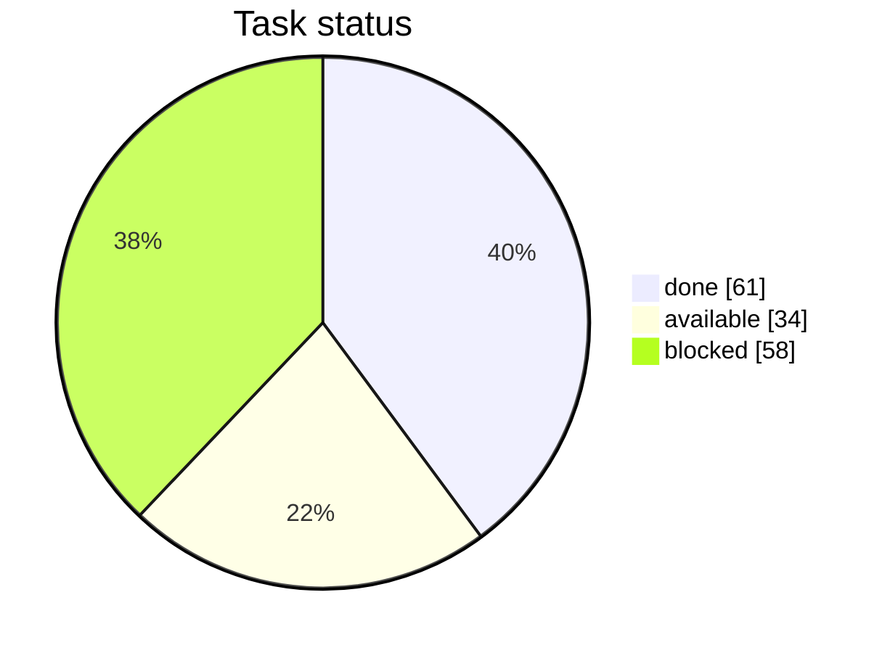
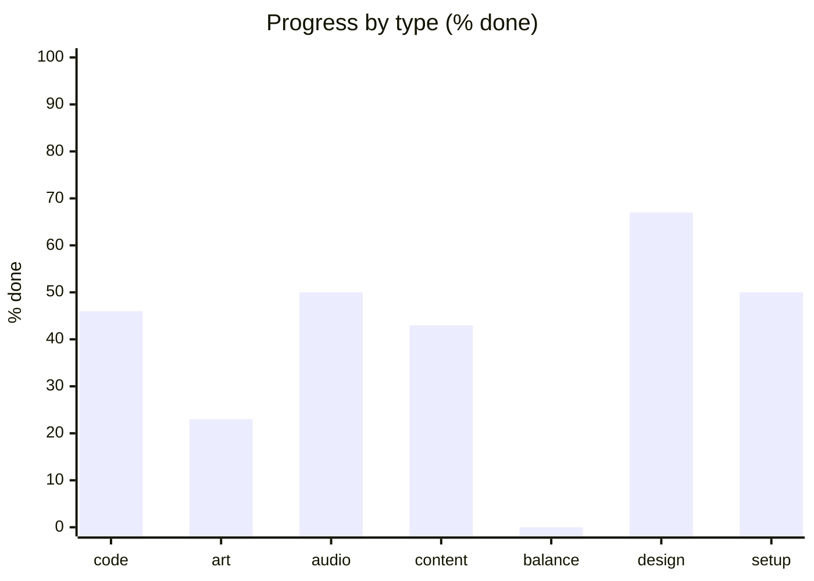

# RallyRivals — Task Status

> Generated by `python3 tasks.py render`. **Do not hand-edit** — edit `tasks.yaml`.

**Overall:** 61/153 done (40%) · 34 available · 58 blocked

## Progress by type

### By subgroup

| type | subgroup | done | total |
|---|---|--:|--:|
| code | core | 4 | 5 |
| code | vehicle | 6 | 10 |
| code | track | 6 | 9 |
| code | ai | 0 | 3 |
| code | race | 2 | 9 |
| code | meta | 0 | 8 |
| code | ui | 5 | 15 |
| code | tools | 8 | 8 |
| art | voxel | 2 | 23 |
| art | vfx | 3 | 7 |
| art | ui-art | 0 | 4 |
| art | world | 2 | 6 |
| art | shader | 3 | 3 |
| audio | sfx | 6 | 8 |
| audio | music | 0 | 4 |
| content | tracks | 0 | 2 |
| content | cars | 2 | 2 |
| content | rivals | 0 | 2 |
| content | surfaces | 1 | 1 |
| balance | handling | 0 | 2 |
| balance | economy | 0 | 1 |
| balance | difficulty | 0 | 2 |
| balance | surfaces | 0 | 1 |
| design | gdd | 3 | 3 |
| design | adr | 3 | 3 |
| design | spec | 1 | 2 |
| design | playtest | 1 | 4 |
| setup | config | 2 | 2 |
| setup | build | 0 | 3 |
| setup | repo | 1 | 1 |

## Available now (34 unblocked)

- `art-ui-hud-gfx` [art/ui-art] (default) — HUD scorebug graphics (telemetry-style)
- `art-ui-theme` [art/ui-art] (big) — VHS UI theme (white-on-blue OSD) + font
- `art-ui-transition` [art/ui-art] (default) — Stylized VHS scene transition (channel-change / tracking-glitch wipe)
- `art-vfx-juice` [art/vfx] (micro) — Screen shake + landing thump
- `art-voxel-props` [art/voxel] (default) — Voxel prop set (rocks/signs/barriers)
- `art-voxel-environment` [art/voxel] (big) — Voxel scenery/buildings set
- `art-voxel-brand-families` [art/voxel] (default) — Visual family per manufacturer
- `art-voxel-car-kerb` [art/voxel] (default) — Voxel car: Kerb (Apex D, starter) — MV pipeline validation
- `art-world-terrain-tex` [art/world] (big) — Terrain splat textures
- `art-world-skybox` [art/world] (default) — Skybox + seasonal sky sets
- `audio-music-direction` [audio/music] (big) — Music direction + sourcing plan
- `balance-economy-tables` [balance/economy] (default) — Payout/price tables (banked-best economy)
- `balance-handling-feel` [balance/handling] (big) — Tune car feel constants (buttery pass)
- `balance-handling-classes` [balance/handling] (default) — Differentiate feel across classes/brands
- `balance-surfaces-grip` [balance/surfaces] (default) — Tune grip values per surface + weather modifiers
- `code-core-pooling` [code/core] (default) — Pooling / perf helpers (perf-first rule)
- `code-meta-currencies` [code/meta] (small) — Money + CP wallets
- `code-meta-classes` [code/meta] (default) — Class system S-D + class gating
- `code-race-director` [code/race] (big) — Race lifecycle director (grid -> 3-2-1-GO countdown -> run -> finish -> freeze -> hand to results)
- `code-race-types` [code/race] (big) — Race types: sprint + circuit
- `code-race-timetrial` [code/race] (small) — Race type: time trial vs clock
- `code-track-seasons` [code/track] (default) — Seasonal visual swap (author-picked per race)
- `code-track-props` [code/track] (default) — Prop scatter from marker map
- `code-track-ai-line` [code/track] (default) — Bake AI racing line from the spline
- `code-ui-statbars` [code/ui] (small) — Five stat bars display widget
- `code-ui-loading` [code/ui] (small) — Loading screen (async scene load)
- `code-ui-pause` [code/ui] (small) — Pause menu
- `code-vehicle-damage` [code/vehicle] (big) — Damage system (visible + performance)
- `code-vehicle-brand-features` [code/vehicle] (default) — Baked-in brand abilities (nitro etc.)
- `code-vehicle-airborne` [code/vehicle] (default) — Airborne handling (jumps: air control + landing)
- `content-rivals-defs` [content/rivals] (default) — Define 4 boss-rivals (brand + class per chapter)
- `content-tracks-first` [content/tracks] (big) — First real track (heightmap/surface/markers images)
- `design-spec-field-matching` [design/spec] (small) — Spec: field-matching rule for open (non-GP) races
- `setup-build-export` [setup/build] (default) — Export presets + exclude prototypes/* from release

## Blocked (58)

- `code-vehicle-slipstream` — waiting on: code-ai-rival
- `code-race-result` — waiting on: code-race-director
- `code-race-endurance` — waiting on: code-race-types
- `code-race-grandprix` — waiting on: code-race-types, code-meta-classes
- `code-race-contact` — waiting on: code-race-result
- `code-ai-rival` — waiting on: code-track-ai-line
- `code-ai-difficulty` — waiting on: code-ai-rival
- `code-ai-boss` — waiting on: code-ai-rival
- `code-ui-prerace` — waiting on: code-ui-statbars
- `code-ui-results` — waiting on: code-race-result
- `code-ui-career-map` — waiting on: code-meta-chapters
- `code-ui-shop` — waiting on: code-meta-shop
- `code-ui-garage` — waiting on: code-meta-garage
- `code-ui-boss-intro` — waiting on: content-rivals-defs
- `code-ui-scorebug` — waiting on: art-ui-hud-gfx
- `code-meta-economy` — waiting on: code-race-result, code-meta-currencies
- `code-meta-shop` — waiting on: code-meta-currencies
- `code-meta-garage` — waiting on: code-meta-currencies
- `code-meta-pinkslip` — waiting on: code-meta-garage, code-ai-boss
- `code-meta-achievements` — waiting on: code-meta-currencies
- `code-meta-chapters` — waiting on: code-meta-economy, code-ai-boss
- `content-rivals-campaign` — waiting on: content-rivals-defs
- `content-tracks-campaign` — waiting on: content-tracks-first, content-rivals-campaign
- `art-voxel-car-mule` — waiting on: art-voxel-brand-families, art-voxel-car-kerb
- `art-voxel-car-spark` — waiting on: art-voxel-brand-families, art-voxel-car-kerb
- `art-voxel-car-tangent` — waiting on: art-voxel-brand-families, art-voxel-car-kerb
- `art-voxel-car-crowbar` — waiting on: art-voxel-brand-families, art-voxel-car-kerb
- `art-voxel-car-fuse` — waiting on: art-voxel-brand-families, art-voxel-car-kerb
- `art-voxel-car-meridian` — waiting on: art-voxel-brand-families, art-voxel-car-kerb
- `art-voxel-car-anvil` — waiting on: art-voxel-brand-families, art-voxel-car-kerb
- `art-voxel-car-strobe` — waiting on: art-voxel-brand-families, art-voxel-car-kerb
- `art-voxel-car-verdict` — waiting on: art-voxel-brand-families, art-voxel-car-kerb
- `art-voxel-car-sledge` — waiting on: art-voxel-brand-families, art-voxel-car-kerb
- `art-voxel-car-comet` — waiting on: art-voxel-brand-families, art-voxel-car-kerb
- `art-voxel-car-stiletto` — waiting on: art-voxel-brand-families, art-voxel-car-kerb
- `art-voxel-car-juggernaut` — waiting on: art-voxel-brand-families, art-voxel-car-kerb
- `art-voxel-car-nova` — waiting on: art-voxel-brand-families, art-voxel-car-kerb
- `art-voxel-wheel-apex` — waiting on: art-voxel-brand-families
- `art-voxel-wheel-wreck` — waiting on: art-voxel-brand-families
- `art-voxel-wheel-mayfly` — waiting on: art-voxel-brand-families
- `art-vfx-slipstream` — waiting on: code-vehicle-slipstream
- `art-vfx-damage` — waiting on: code-vehicle-damage
- `art-vfx-nitro` — waiting on: code-vehicle-brand-features
- `art-ui-paint-skins` — waiting on: art-voxel-car-kerb
- `art-world-regions` — waiting on: art-voxel-environment
- `art-world-seasons` — waiting on: code-track-seasons, art-voxel-environment
- `audio-sfx-slipstream` — waiting on: code-vehicle-slipstream
- `audio-sfx-nitro` — waiting on: code-vehicle-brand-features
- `audio-music-menu` — waiting on: audio-music-direction
- `audio-music-race` — waiting on: audio-music-direction
- `audio-music-boss` — waiting on: audio-music-direction
- `balance-difficulty-ai` — waiting on: code-ai-difficulty
- `balance-difficulty-pacing` — waiting on: code-meta-chapters
- `design-playtest-race` — waiting on: code-race-result, code-ai-rival
- `design-playtest-slice` — waiting on: code-ui-results, art-voxel-car-kerb
- `design-playtest-loop` — waiting on: code-meta-chapters, code-ui-career-map
- `setup-build-platforms` — waiting on: setup-build-export
- `setup-build-launch` — waiting on: setup-build-export

## Dependency graph (remaining work)

_Green = available now · gray = blocked. Done tasks omitted._

```mermaid
flowchart LR
  subgraph code
    code_track_seasons["track-seasons"]
    code_track_props["track-props"]
    code_track_ai_line["track-ai-line"]
    code_vehicle_damage["vehicle-damage"]
    code_vehicle_slipstream["vehicle-slipstream"]
    code_vehicle_brand_features["vehicle-brand-features"]
    code_vehicle_airborne["vehicle-airborne"]
    code_core_pooling["core-pooling"]
    code_race_director["race-director"]
    code_race_result["race-result"]
    code_race_types["race-types"]
    code_race_timetrial["race-timetrial"]
    code_race_endurance["race-endurance"]
    code_race_grandprix["race-grandprix"]
    code_race_contact["race-contact"]
    code_ai_rival["ai-rival"]
    code_ai_difficulty["ai-difficulty"]
    code_ai_boss["ai-boss"]
    code_ui_statbars["ui-statbars"]
    code_ui_loading["ui-loading"]
    code_ui_prerace["ui-prerace"]
    code_ui_results["ui-results"]
    code_ui_career_map["ui-career-map"]
    code_ui_shop["ui-shop"]
    code_ui_garage["ui-garage"]
    code_ui_boss_intro["ui-boss-intro"]
    code_ui_pause["ui-pause"]
    code_ui_scorebug["ui-scorebug"]
    code_meta_currencies["meta-currencies"]
    code_meta_economy["meta-economy"]
    code_meta_classes["meta-classes"]
    code_meta_shop["meta-shop"]
    code_meta_garage["meta-garage"]
    code_meta_pinkslip["meta-pinkslip"]
    code_meta_achievements["meta-achievements"]
    code_meta_chapters["meta-chapters"]
  end
  subgraph art
    art_voxel_props["voxel-props"]
    art_voxel_environment["voxel-environment"]
    art_voxel_brand_families["voxel-brand-families"]
    art_voxel_car_kerb["voxel-car-kerb"]
    art_voxel_car_mule["voxel-car-mule"]
    art_voxel_car_spark["voxel-car-spark"]
    art_voxel_car_tangent["voxel-car-tangent"]
    art_voxel_car_crowbar["voxel-car-crowbar"]
    art_voxel_car_fuse["voxel-car-fuse"]
    art_voxel_car_meridian["voxel-car-meridian"]
    art_voxel_car_anvil["voxel-car-anvil"]
    art_voxel_car_strobe["voxel-car-strobe"]
    art_voxel_car_verdict["voxel-car-verdict"]
    art_voxel_car_sledge["voxel-car-sledge"]
    art_voxel_car_comet["voxel-car-comet"]
    art_voxel_car_stiletto["voxel-car-stiletto"]
    art_voxel_car_juggernaut["voxel-car-juggernaut"]
    art_voxel_car_nova["voxel-car-nova"]
    art_voxel_wheel_apex["voxel-wheel-apex"]
    art_voxel_wheel_wreck["voxel-wheel-wreck"]
    art_voxel_wheel_mayfly["voxel-wheel-mayfly"]
    art_vfx_juice["vfx-juice"]
    art_vfx_slipstream["vfx-slipstream"]
    art_vfx_damage["vfx-damage"]
    art_vfx_nitro["vfx-nitro"]
    art_ui_hud_gfx["ui-hud-gfx"]
    art_ui_theme["ui-theme"]
    art_ui_transition["ui-transition"]
    art_ui_paint_skins["ui-paint-skins"]
    art_world_terrain_tex["world-terrain-tex"]
    art_world_skybox["world-skybox"]
    art_world_regions["world-regions"]
    art_world_seasons["world-seasons"]
  end
  subgraph audio
    audio_sfx_slipstream["sfx-slipstream"]
    audio_sfx_nitro["sfx-nitro"]
    audio_music_direction["music-direction"]
    audio_music_menu["music-menu"]
    audio_music_race["music-race"]
    audio_music_boss["music-boss"]
  end
  subgraph content
    content_rivals_defs["rivals-defs"]
    content_rivals_campaign["rivals-campaign"]
    content_tracks_first["tracks-first"]
    content_tracks_campaign["tracks-campaign"]
  end
  subgraph balance
    balance_handling_feel["handling-feel"]
    balance_handling_classes["handling-classes"]
    balance_economy_tables["economy-tables"]
    balance_difficulty_ai["difficulty-ai"]
    balance_difficulty_pacing["difficulty-pacing"]
    balance_surfaces_grip["surfaces-grip"]
  end
  subgraph design
    design_spec_field_matching["spec-field-matching"]
    design_playtest_race["playtest-race"]
    design_playtest_slice["playtest-slice"]
    design_playtest_loop["playtest-loop"]
  end
  subgraph setup
    setup_build_export["build-export"]
    setup_build_platforms["build-platforms"]
    setup_build_launch["build-launch"]
  end
  code_ai_rival --> code_vehicle_slipstream
  code_race_director --> code_race_result
  code_race_types --> code_race_endurance
  code_race_types --> code_race_grandprix
  code_meta_classes --> code_race_grandprix
  code_race_result --> code_race_contact
  code_track_ai_line --> code_ai_rival
  code_ai_rival --> code_ai_difficulty
  code_ai_rival --> code_ai_boss
  code_ui_statbars --> code_ui_prerace
  code_race_result --> code_ui_results
  code_meta_chapters --> code_ui_career_map
  code_meta_shop --> code_ui_shop
  code_meta_garage --> code_ui_garage
  content_rivals_defs --> code_ui_boss_intro
  art_ui_hud_gfx --> code_ui_scorebug
  code_race_result --> code_meta_economy
  code_meta_currencies --> code_meta_economy
  code_meta_currencies --> code_meta_shop
  code_meta_currencies --> code_meta_garage
  code_meta_garage --> code_meta_pinkslip
  code_ai_boss --> code_meta_pinkslip
  code_meta_currencies --> code_meta_achievements
  code_meta_economy --> code_meta_chapters
  code_ai_boss --> code_meta_chapters
  content_rivals_defs --> content_rivals_campaign
  content_tracks_first --> content_tracks_campaign
  content_rivals_campaign --> content_tracks_campaign
  art_voxel_brand_families --> art_voxel_car_mule
  art_voxel_car_kerb --> art_voxel_car_mule
  art_voxel_brand_families --> art_voxel_car_spark
  art_voxel_car_kerb --> art_voxel_car_spark
  art_voxel_brand_families --> art_voxel_car_tangent
  art_voxel_car_kerb --> art_voxel_car_tangent
  art_voxel_brand_families --> art_voxel_car_crowbar
  art_voxel_car_kerb --> art_voxel_car_crowbar
  art_voxel_brand_families --> art_voxel_car_fuse
  art_voxel_car_kerb --> art_voxel_car_fuse
  art_voxel_brand_families --> art_voxel_car_meridian
  art_voxel_car_kerb --> art_voxel_car_meridian
  art_voxel_brand_families --> art_voxel_car_anvil
  art_voxel_car_kerb --> art_voxel_car_anvil
  art_voxel_brand_families --> art_voxel_car_strobe
  art_voxel_car_kerb --> art_voxel_car_strobe
  art_voxel_brand_families --> art_voxel_car_verdict
  art_voxel_car_kerb --> art_voxel_car_verdict
  art_voxel_brand_families --> art_voxel_car_sledge
  art_voxel_car_kerb --> art_voxel_car_sledge
  art_voxel_brand_families --> art_voxel_car_comet
  art_voxel_car_kerb --> art_voxel_car_comet
  art_voxel_brand_families --> art_voxel_car_stiletto
  art_voxel_car_kerb --> art_voxel_car_stiletto
  art_voxel_brand_families --> art_voxel_car_juggernaut
  art_voxel_car_kerb --> art_voxel_car_juggernaut
  art_voxel_brand_families --> art_voxel_car_nova
  art_voxel_car_kerb --> art_voxel_car_nova
  art_voxel_brand_families --> art_voxel_wheel_apex
  art_voxel_brand_families --> art_voxel_wheel_wreck
  art_voxel_brand_families --> art_voxel_wheel_mayfly
  code_vehicle_slipstream --> art_vfx_slipstream
  code_vehicle_damage --> art_vfx_damage
  code_vehicle_brand_features --> art_vfx_nitro
  art_voxel_car_kerb --> art_ui_paint_skins
  art_voxel_environment --> art_world_regions
  code_track_seasons --> art_world_seasons
  art_voxel_environment --> art_world_seasons
  code_vehicle_slipstream --> audio_sfx_slipstream
  code_vehicle_brand_features --> audio_sfx_nitro
  audio_music_direction --> audio_music_menu
  audio_music_direction --> audio_music_race
  audio_music_direction --> audio_music_boss
  code_ai_difficulty --> balance_difficulty_ai
  code_meta_chapters --> balance_difficulty_pacing
  code_race_result --> design_playtest_race
  code_ai_rival --> design_playtest_race
  code_ui_results --> design_playtest_slice
  art_voxel_car_kerb --> design_playtest_slice
  code_meta_chapters --> design_playtest_loop
  code_ui_career_map --> design_playtest_loop
  setup_build_export --> setup_build_platforms
  setup_build_export --> setup_build_launch
  classDef avail fill:#d6f5d6,stroke:#2e7d32,color:#1b3d1b;
  classDef blocked fill:#f0f0f0,stroke:#9e9e9e,color:#555;
  class code_track_seasons,code_track_props,code_track_ai_line,code_vehicle_damage,code_vehicle_brand_features,code_vehicle_airborne,code_core_pooling,code_race_director,code_race_types,code_race_timetrial,code_ui_statbars,code_ui_loading,code_ui_pause,code_meta_currencies,code_meta_classes,content_rivals_defs,content_tracks_first,art_voxel_props,art_voxel_environment,art_voxel_brand_families,art_voxel_car_kerb,art_vfx_juice,art_ui_hud_gfx,art_ui_theme,art_ui_transition,art_world_terrain_tex,art_world_skybox,audio_music_direction,balance_handling_feel,balance_handling_classes,balance_economy_tables,balance_surfaces_grip,design_spec_field_matching,setup_build_export avail;
  class code_vehicle_slipstream,code_race_result,code_race_endurance,code_race_grandprix,code_race_contact,code_ai_rival,code_ai_difficulty,code_ai_boss,code_ui_prerace,code_ui_results,code_ui_career_map,code_ui_shop,code_ui_garage,code_ui_boss_intro,code_ui_scorebug,code_meta_economy,code_meta_shop,code_meta_garage,code_meta_pinkslip,code_meta_achievements,code_meta_chapters,content_rivals_campaign,content_tracks_campaign,art_voxel_car_mule,art_voxel_car_spark,art_voxel_car_tangent,art_voxel_car_crowbar,art_voxel_car_fuse,art_voxel_car_meridian,art_voxel_car_anvil,art_voxel_car_strobe,art_voxel_car_verdict,art_voxel_car_sledge,art_voxel_car_comet,art_voxel_car_stiletto,art_voxel_car_juggernaut,art_voxel_car_nova,art_voxel_wheel_apex,art_voxel_wheel_wreck,art_voxel_wheel_mayfly,art_vfx_slipstream,art_vfx_damage,art_vfx_nitro,art_ui_paint_skins,art_world_regions,art_world_seasons,audio_sfx_slipstream,audio_sfx_nitro,audio_music_menu,audio_music_race,audio_music_boss,balance_difficulty_ai,balance_difficulty_pacing,design_playtest_race,design_playtest_slice,design_playtest_loop,setup_build_platforms,setup_build_launch blocked;
```

