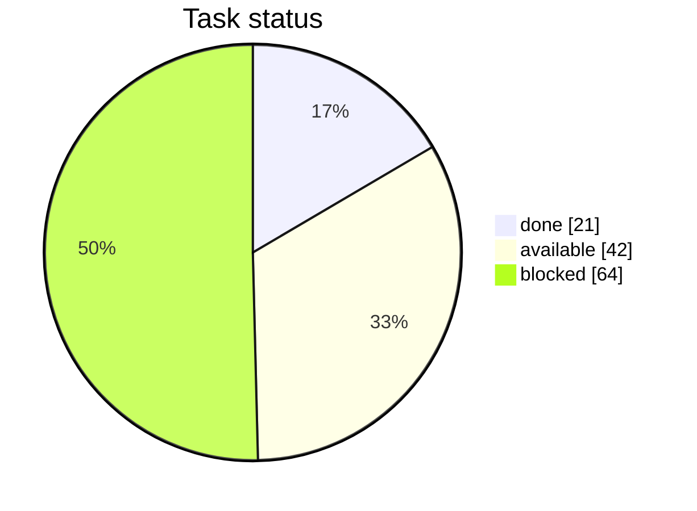
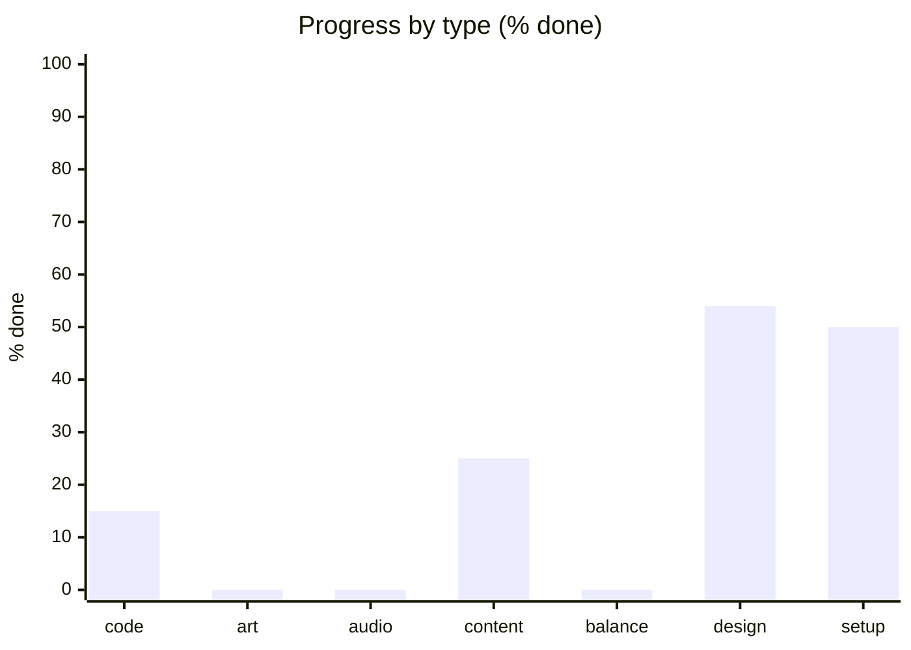

# RallyRivals — Task Status

> Generated by `python3 tasks.py render`. **Do not hand-edit** — edit `tasks.yaml`.

**Overall:** 21/127 done (17%) · 42 available · 64 blocked

## Progress by type

### By subgroup

| type | subgroup | done | total |
|---|---|--:|--:|
| code | core | 1 | 5 |
| code | vehicle | 3 | 8 |
| code | track | 3 | 8 |
| code | ai | 0 | 3 |
| code | race | 0 | 8 |
| code | meta | 0 | 8 |
| code | ui | 0 | 11 |
| code | tools | 2 | 8 |
| art | voxel | 0 | 6 |
| art | vfx | 0 | 6 |
| art | ui-art | 0 | 5 |
| art | world | 0 | 5 |
| art | shader | 0 | 2 |
| audio | sfx | 0 | 7 |
| audio | music | 0 | 4 |
| content | tracks | 0 | 2 |
| content | cars | 1 | 2 |
| content | rivals | 0 | 3 |
| content | surfaces | 1 | 1 |
| balance | handling | 0 | 2 |
| balance | economy | 0 | 1 |
| balance | difficulty | 0 | 2 |
| balance | surfaces | 0 | 1 |
| design | gdd | 3 | 3 |
| design | adr | 2 | 3 |
| design | spec | 1 | 3 |
| design | playtest | 1 | 4 |
| setup | config | 2 | 2 |
| setup | build | 0 | 3 |
| setup | repo | 1 | 1 |

## Available now (42 unblocked)

- `art-shader-surface` [art/shader] (default) — Terrain surface/splat-blend shader
- `art-shader-road` [art/shader] (default) — Road shader (markings/wetness)
- `art-ui-hud-gfx` [art/ui-art] (default) — HUD gauges/glow graphics
- `art-ui-theme` [art/ui-art] (big) — Menu/UI theme + icon set
- `art-vfx-juice` [art/vfx] (micro) — Screen shake + landing thump
- `art-vfx-surface-particles` [art/vfx] (default) — Per-surface particles (dust/snow/spray)
- `art-vfx-weather` [art/vfx] (big) — Weather visuals (rain/snow/fog)
- `art-voxel-car-blockout` [art/voxel] (default) — Placeholder voxel car block-out
- `art-voxel-props` [art/voxel] (default) — Voxel prop set (rocks/signs/barriers)
- `art-voxel-environment` [art/voxel] (big) — Voxel scenery/buildings set
- `art-world-terrain-tex` [art/world] (big) — Terrain splat textures
- `art-world-skybox` [art/world] (default) — Skybox + seasonal sky sets
- `art-world-lighting` [art/world] (default) — Time-of-day lighting presets
- `audio-music-direction` [audio/music] (big) — Music direction + sourcing plan
- `audio-sfx-engine` [audio/sfx] (default) — Engine loop wired to throttle (CC0)
- `audio-sfx-surface` [audio/sfx] (default) — Per-surface tire SFX (CC0)
- `audio-sfx-ui` [audio/sfx] (small) — UI clicks/confirms
- `audio-sfx-ambient` [audio/sfx] (default) — Ambient/crowd bed (festival)
- `balance-economy-tables` [balance/economy] (default) — Payout/price tables (banked-best economy)
- `balance-handling-feel` [balance/handling] (big) — Tune car feel constants (buttery pass)
- `code-core-scene-flow` [code/core] (default) — Scene/flow manager + pause
- `code-core-pooling` [code/core] (default) — Pooling / perf helpers (perf-first rule)
- `code-meta-currencies` [code/meta] (small) — Money + CP wallets
- `code-race-defs` [code/race] (default) — RaceDef resource (track, type, culture, conditions, reward pools)
- `code-race-timing` [code/race] (default) — Lap/stage timing
- `code-tools-map-editor-shell` [code/tools] (huge) — Map editor: canvas shell (zoom/pan, blueprint underlay, layer toggles, save/load)
- `code-track-seasons` [code/track] (default) — Seasonal visual swap (author-picked per race)
- `code-track-props` [code/track] (default) — Prop scatter from marker map
- `code-track-ai-line` [code/track] (default) — Bake AI racing line from the spline
- `code-track-weather-grip` [code/track] (small) — Weather grip modifier (stacks on surface grip)
- `code-ui-statbars` [code/ui] (small) — Five stat bars display widget
- `code-vehicle-damage` [code/vehicle] (big) — Damage system (visible + performance)
- `code-vehicle-stats` [code/vehicle] (default) — Drive handling from the 5 stat bars
- `code-vehicle-brand-features` [code/vehicle] (default) — Baked-in brand abilities (nitro etc.)
- `code-vehicle-airborne` [code/vehicle] (default) — Airborne handling (jumps: air control + landing)
- `content-cars-roster` [content/cars] (default) — Define car stat roster (classes S-D)
- `content-rivals-defs` [content/rivals] (default) — Define 4 boss-rivals + taunts
- `content-tracks-first` [content/tracks] (big) — First real track (heightmap/surface/markers images)
- `design-adr-voxel-pipeline` [design/adr] (default) — ADR: voxel art pipeline (export/runtime, FX, coherence)
- `design-spec-vehicle` [design/spec] (small) — Spec: vehicle controller feel-criteria
- `design-spec-field-matching` [design/spec] (small) — Spec: field-matching rule for open (non-GP) races
- `setup-build-export` [setup/build] (default) — Export presets + exclude prototypes/* from release

## Blocked (64)

- `code-track-conditions` — waiting on: code-race-defs
- `code-tools-map-editor-surface` — waiting on: code-tools-map-editor-shell
- `code-tools-map-editor-race` — waiting on: code-tools-map-editor-shell
- `code-tools-map-editor-props` — waiting on: code-tools-map-editor-shell
- `code-tools-map-editor-height` — waiting on: code-tools-map-editor-surface
- `code-tools-map-editor-export` — waiting on: code-tools-map-editor-surface, code-tools-map-editor-race
- `code-vehicle-slipstream` — waiting on: code-ai-rival
- `code-core-save` — waiting on: code-core-scene-flow
- `code-core-settings-apply` — waiting on: code-core-scene-flow
- `code-race-result` — waiting on: code-race-timing
- `code-race-types` — waiting on: code-race-timing
- `code-race-timetrial` — waiting on: code-race-timing
- `code-race-endurance` — waiting on: code-race-types
- `code-race-grandprix` — waiting on: code-race-types, code-meta-classes
- `code-race-contact` — waiting on: code-race-result, code-race-defs
- `code-ai-rival` — waiting on: code-track-ai-line
- `code-ai-difficulty` — waiting on: code-ai-rival
- `code-ai-boss` — waiting on: code-ai-rival
- `code-ui-hud` — waiting on: code-race-timing
- `code-ui-menus` — waiting on: code-core-scene-flow
- `code-ui-loading` — waiting on: code-core-scene-flow
- `code-ui-prerace` — waiting on: code-ui-statbars, code-race-defs
- `code-ui-results` — waiting on: code-race-result, code-meta-economy
- `code-ui-career-map` — waiting on: code-core-scene-flow, code-meta-chapters, code-race-defs
- `code-ui-shop` — waiting on: code-meta-shop
- `code-ui-garage` — waiting on: code-meta-garage
- `code-ui-boss-intro` — waiting on: content-rivals-defs
- `code-ui-pause` — waiting on: code-core-scene-flow
- `code-meta-economy` — waiting on: code-race-result, code-meta-currencies, code-race-defs
- `code-meta-classes` — waiting on: content-cars-roster
- `code-meta-shop` — waiting on: code-meta-currencies, content-cars-roster
- `code-meta-garage` — waiting on: code-meta-currencies
- `code-meta-pinkslip` — waiting on: code-meta-garage, code-ai-boss
- `code-meta-achievements` — waiting on: code-meta-currencies
- `code-meta-chapters` — waiting on: code-meta-economy, code-ai-boss
- `content-rivals-campaign` — waiting on: content-rivals-defs
- `content-rivals-story` — waiting on: content-rivals-defs
- `content-tracks-campaign` — waiting on: content-tracks-first, content-rivals-campaign
- `art-voxel-car-first` — waiting on: art-voxel-car-blockout
- `art-voxel-brand-families` — waiting on: content-cars-roster
- `art-voxel-car-roster` — waiting on: art-voxel-car-first, art-voxel-brand-families
- `art-vfx-slipstream` — waiting on: code-vehicle-slipstream
- `art-vfx-damage` — waiting on: code-vehicle-damage
- `art-vfx-nitro` — waiting on: code-vehicle-brand-features
- `art-ui-portraits` — waiting on: content-rivals-defs
- `art-ui-boss-anim` — waiting on: content-rivals-defs
- `art-ui-paint-skins` — waiting on: art-voxel-car-first
- `art-world-regions` — waiting on: art-voxel-environment
- `art-world-seasons` — waiting on: code-track-seasons, art-voxel-environment
- `audio-sfx-impact` — waiting on: code-vehicle-damage
- `audio-sfx-slipstream` — waiting on: code-vehicle-slipstream
- `audio-sfx-nitro` — waiting on: code-vehicle-brand-features
- `audio-music-menu` — waiting on: audio-music-direction
- `audio-music-race` — waiting on: audio-music-direction
- `audio-music-boss` — waiting on: audio-music-direction
- `balance-handling-classes` — waiting on: content-cars-roster, code-vehicle-stats
- `balance-difficulty-ai` — waiting on: code-ai-difficulty
- `balance-difficulty-pacing` — waiting on: code-meta-chapters
- `balance-surfaces-grip` — waiting on: code-track-weather-grip
- `design-playtest-race` — waiting on: code-race-result, code-ai-rival
- `design-playtest-slice` — waiting on: code-ui-results, audio-sfx-engine, art-voxel-car-first
- `design-playtest-loop` — waiting on: code-meta-chapters, code-ui-career-map
- `setup-build-platforms` — waiting on: setup-build-export
- `setup-build-launch` — waiting on: setup-build-export

## Dependency graph (remaining work)

_Green = available now · gray = blocked. Done tasks omitted._

```mermaid
flowchart LR
  subgraph code
    code_track_seasons["track-seasons"]
    code_track_props["track-props"]
    code_track_ai_line["track-ai-line"]
    code_track_weather_grip["track-weather-grip"]
    code_track_conditions["track-conditions"]
    code_tools_map_editor_shell["tools-map-editor-shell"]
    code_tools_map_editor_surface["tools-map-editor-surface"]
    code_tools_map_editor_race["tools-map-editor-race"]
    code_tools_map_editor_props["tools-map-editor-props"]
    code_tools_map_editor_height["tools-map-editor-height"]
    code_tools_map_editor_export["tools-map-editor-export"]
    code_vehicle_damage["vehicle-damage"]
    code_vehicle_slipstream["vehicle-slipstream"]
    code_vehicle_stats["vehicle-stats"]
    code_vehicle_brand_features["vehicle-brand-features"]
    code_vehicle_airborne["vehicle-airborne"]
    code_core_scene_flow["core-scene-flow"]
    code_core_save["core-save"]
    code_core_pooling["core-pooling"]
    code_core_settings_apply["core-settings-apply"]
    code_race_defs["race-defs"]
    code_race_timing["race-timing"]
    code_race_result["race-result"]
    code_race_types["race-types"]
    code_race_timetrial["race-timetrial"]
    code_race_endurance["race-endurance"]
    code_race_grandprix["race-grandprix"]
    code_race_contact["race-contact"]
    code_ai_rival["ai-rival"]
    code_ai_difficulty["ai-difficulty"]
    code_ai_boss["ai-boss"]
    code_ui_statbars["ui-statbars"]
    code_ui_hud["ui-hud"]
    code_ui_menus["ui-menus"]
    code_ui_loading["ui-loading"]
    code_ui_prerace["ui-prerace"]
    code_ui_results["ui-results"]
    code_ui_career_map["ui-career-map"]
    code_ui_shop["ui-shop"]
    code_ui_garage["ui-garage"]
    code_ui_boss_intro["ui-boss-intro"]
    code_ui_pause["ui-pause"]
    code_meta_currencies["meta-currencies"]
    code_meta_economy["meta-economy"]
    code_meta_classes["meta-classes"]
    code_meta_shop["meta-shop"]
    code_meta_garage["meta-garage"]
    code_meta_pinkslip["meta-pinkslip"]
    code_meta_achievements["meta-achievements"]
    code_meta_chapters["meta-chapters"]
  end
  subgraph art
    art_voxel_car_blockout["voxel-car-blockout"]
    art_voxel_car_first["voxel-car-first"]
    art_voxel_props["voxel-props"]
    art_voxel_environment["voxel-environment"]
    art_voxel_brand_families["voxel-brand-families"]
    art_voxel_car_roster["voxel-car-roster"]
    art_vfx_juice["vfx-juice"]
    art_vfx_surface_particles["vfx-surface-particles"]
    art_vfx_slipstream["vfx-slipstream"]
    art_vfx_damage["vfx-damage"]
    art_vfx_weather["vfx-weather"]
    art_vfx_nitro["vfx-nitro"]
    art_ui_portraits["ui-portraits"]
    art_ui_hud_gfx["ui-hud-gfx"]
    art_ui_theme["ui-theme"]
    art_ui_boss_anim["ui-boss-anim"]
    art_ui_paint_skins["ui-paint-skins"]
    art_world_terrain_tex["world-terrain-tex"]
    art_world_skybox["world-skybox"]
    art_world_lighting["world-lighting"]
    art_world_regions["world-regions"]
    art_world_seasons["world-seasons"]
    art_shader_surface["shader-surface"]
    art_shader_road["shader-road"]
  end
  subgraph audio
    audio_sfx_engine["sfx-engine"]
    audio_sfx_surface["sfx-surface"]
    audio_sfx_impact["sfx-impact"]
    audio_sfx_slipstream["sfx-slipstream"]
    audio_sfx_nitro["sfx-nitro"]
    audio_sfx_ui["sfx-ui"]
    audio_sfx_ambient["sfx-ambient"]
    audio_music_direction["music-direction"]
    audio_music_menu["music-menu"]
    audio_music_race["music-race"]
    audio_music_boss["music-boss"]
  end
  subgraph content
    content_cars_roster["cars-roster"]
    content_rivals_defs["rivals-defs"]
    content_rivals_campaign["rivals-campaign"]
    content_rivals_story["rivals-story"]
    content_tracks_first["tracks-first"]
    content_tracks_campaign["tracks-campaign"]
  end
  subgraph balance
    balance_handling_feel["handling-feel"]
    balance_handling_classes["handling-classes"]
    balance_economy_tables["economy-tables"]
    balance_difficulty_ai["difficulty-ai"]
    balance_difficulty_pacing["difficulty-pacing"]
    balance_surfaces_grip["surfaces-grip"]
  end
  subgraph design
    design_adr_voxel_pipeline["adr-voxel-pipeline"]
    design_spec_vehicle["spec-vehicle"]
    design_spec_field_matching["spec-field-matching"]
    design_playtest_race["playtest-race"]
    design_playtest_slice["playtest-slice"]
    design_playtest_loop["playtest-loop"]
  end
  subgraph setup
    setup_build_export["build-export"]
    setup_build_platforms["build-platforms"]
    setup_build_launch["build-launch"]
  end
  code_race_defs --> code_track_conditions
  code_tools_map_editor_shell --> code_tools_map_editor_surface
  code_tools_map_editor_shell --> code_tools_map_editor_race
  code_tools_map_editor_shell --> code_tools_map_editor_props
  code_tools_map_editor_surface --> code_tools_map_editor_height
  code_tools_map_editor_surface --> code_tools_map_editor_export
  code_tools_map_editor_race --> code_tools_map_editor_export
  code_ai_rival --> code_vehicle_slipstream
  code_core_scene_flow --> code_core_save
  code_core_scene_flow --> code_core_settings_apply
  code_race_timing --> code_race_result
  code_race_timing --> code_race_types
  code_race_timing --> code_race_timetrial
  code_race_types --> code_race_endurance
  code_race_types --> code_race_grandprix
  code_meta_classes --> code_race_grandprix
  code_race_result --> code_race_contact
  code_race_defs --> code_race_contact
  code_track_ai_line --> code_ai_rival
  code_ai_rival --> code_ai_difficulty
  code_ai_rival --> code_ai_boss
  code_race_timing --> code_ui_hud
  code_core_scene_flow --> code_ui_menus
  code_core_scene_flow --> code_ui_loading
  code_ui_statbars --> code_ui_prerace
  code_race_defs --> code_ui_prerace
  code_race_result --> code_ui_results
  code_meta_economy --> code_ui_results
  code_core_scene_flow --> code_ui_career_map
  code_meta_chapters --> code_ui_career_map
  code_race_defs --> code_ui_career_map
  code_meta_shop --> code_ui_shop
  code_meta_garage --> code_ui_garage
  content_rivals_defs --> code_ui_boss_intro
  code_core_scene_flow --> code_ui_pause
  code_race_result --> code_meta_economy
  code_meta_currencies --> code_meta_economy
  code_race_defs --> code_meta_economy
  content_cars_roster --> code_meta_classes
  code_meta_currencies --> code_meta_shop
  content_cars_roster --> code_meta_shop
  code_meta_currencies --> code_meta_garage
  code_meta_garage --> code_meta_pinkslip
  code_ai_boss --> code_meta_pinkslip
  code_meta_currencies --> code_meta_achievements
  code_meta_economy --> code_meta_chapters
  code_ai_boss --> code_meta_chapters
  content_rivals_defs --> content_rivals_campaign
  content_rivals_defs --> content_rivals_story
  content_tracks_first --> content_tracks_campaign
  content_rivals_campaign --> content_tracks_campaign
  art_voxel_car_blockout --> art_voxel_car_first
  content_cars_roster --> art_voxel_brand_families
  art_voxel_car_first --> art_voxel_car_roster
  art_voxel_brand_families --> art_voxel_car_roster
  code_vehicle_slipstream --> art_vfx_slipstream
  code_vehicle_damage --> art_vfx_damage
  code_vehicle_brand_features --> art_vfx_nitro
  content_rivals_defs --> art_ui_portraits
  content_rivals_defs --> art_ui_boss_anim
  art_voxel_car_first --> art_ui_paint_skins
  art_voxel_environment --> art_world_regions
  code_track_seasons --> art_world_seasons
  art_voxel_environment --> art_world_seasons
  code_vehicle_damage --> audio_sfx_impact
  code_vehicle_slipstream --> audio_sfx_slipstream
  code_vehicle_brand_features --> audio_sfx_nitro
  audio_music_direction --> audio_music_menu
  audio_music_direction --> audio_music_race
  audio_music_direction --> audio_music_boss
  content_cars_roster --> balance_handling_classes
  code_vehicle_stats --> balance_handling_classes
  code_ai_difficulty --> balance_difficulty_ai
  code_meta_chapters --> balance_difficulty_pacing
  code_track_weather_grip --> balance_surfaces_grip
  code_race_result --> design_playtest_race
  code_ai_rival --> design_playtest_race
  code_ui_results --> design_playtest_slice
  audio_sfx_engine --> design_playtest_slice
  art_voxel_car_first --> design_playtest_slice
  code_meta_chapters --> design_playtest_loop
  code_ui_career_map --> design_playtest_loop
  setup_build_export --> setup_build_platforms
  setup_build_export --> setup_build_launch
  classDef avail fill:#d6f5d6,stroke:#2e7d32,color:#1b3d1b;
  classDef blocked fill:#f0f0f0,stroke:#9e9e9e,color:#555;
  class code_track_seasons,code_track_props,code_track_ai_line,code_track_weather_grip,code_tools_map_editor_shell,code_vehicle_damage,code_vehicle_stats,code_vehicle_brand_features,code_vehicle_airborne,code_core_scene_flow,code_core_pooling,code_race_defs,code_race_timing,code_ui_statbars,code_meta_currencies,content_cars_roster,content_rivals_defs,content_tracks_first,art_voxel_car_blockout,art_voxel_props,art_voxel_environment,art_vfx_juice,art_vfx_surface_particles,art_vfx_weather,art_ui_hud_gfx,art_ui_theme,art_world_terrain_tex,art_world_skybox,art_world_lighting,art_shader_surface,art_shader_road,audio_sfx_engine,audio_sfx_surface,audio_sfx_ui,audio_sfx_ambient,audio_music_direction,balance_handling_feel,balance_economy_tables,design_adr_voxel_pipeline,design_spec_vehicle,design_spec_field_matching,setup_build_export avail;
  class code_track_conditions,code_tools_map_editor_surface,code_tools_map_editor_race,code_tools_map_editor_props,code_tools_map_editor_height,code_tools_map_editor_export,code_vehicle_slipstream,code_core_save,code_core_settings_apply,code_race_result,code_race_types,code_race_timetrial,code_race_endurance,code_race_grandprix,code_race_contact,code_ai_rival,code_ai_difficulty,code_ai_boss,code_ui_hud,code_ui_menus,code_ui_loading,code_ui_prerace,code_ui_results,code_ui_career_map,code_ui_shop,code_ui_garage,code_ui_boss_intro,code_ui_pause,code_meta_economy,code_meta_classes,code_meta_shop,code_meta_garage,code_meta_pinkslip,code_meta_achievements,code_meta_chapters,content_rivals_campaign,content_rivals_story,content_tracks_campaign,art_voxel_car_first,art_voxel_brand_families,art_voxel_car_roster,art_vfx_slipstream,art_vfx_damage,art_vfx_nitro,art_ui_portraits,art_ui_boss_anim,art_ui_paint_skins,art_world_regions,art_world_seasons,audio_sfx_impact,audio_sfx_slipstream,audio_sfx_nitro,audio_music_menu,audio_music_race,audio_music_boss,balance_handling_classes,balance_difficulty_ai,balance_difficulty_pacing,balance_surfaces_grip,design_playtest_race,design_playtest_slice,design_playtest_loop,setup_build_platforms,setup_build_launch blocked;
```

