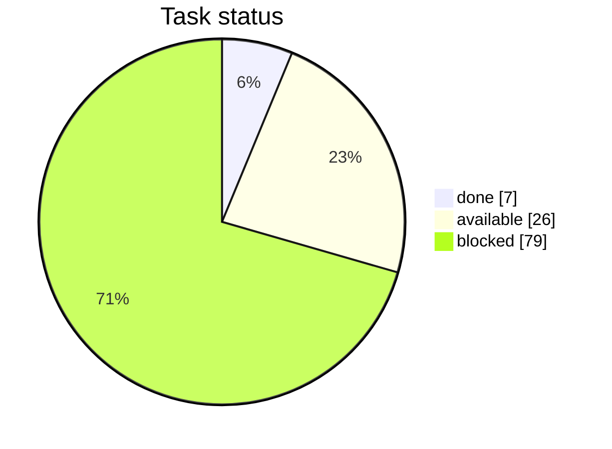

# RallyRivals — Task Status

> Generated by `python3 tasks.py render`. **Do not hand-edit** — edit `tasks.yaml`.

**Overall:** `[#-------------------]   6% (7/112)`

## By type

- **code** `[----------------]   0% (0/50)`
    - core: `[------------]   0% (0/5)`
    - vehicle: `[------------]   0% (0/7)`
    - track: `[------------]   0% (0/7)`
    - ai: `[------------]   0% (0/3)`
    - race: `[------------]   0% (0/7)`
    - meta: `[------------]   0% (0/8)`
    - ui: `[------------]   0% (0/11)`
    - tools: `[------------]   0% (0/2)`
- **art** `[----------------]   0% (0/22)`
    - voxel: `[------------]   0% (0/5)`
    - vfx: `[------------]   0% (0/6)`
    - ui-art: `[------------]   0% (0/5)`
    - world: `[------------]   0% (0/4)`
    - shader: `[------------]   0% (0/2)`
- **audio** `[----------------]   0% (0/11)`
    - sfx: `[------------]   0% (0/7)`
    - music: `[------------]   0% (0/4)`
- **content** `[----------------]   0% (0/6)`
    - tracks: `[------------]   0% (0/1)`
    - cars: `[------------]   0% (0/2)`
    - rivals: `[------------]   0% (0/2)`
    - surfaces: `[------------]   0% (0/1)`
- **balance** `[----------------]   0% (0/6)`
    - handling: `[------------]   0% (0/2)`
    - economy: `[------------]   0% (0/1)`
    - difficulty: `[------------]   0% (0/2)`
    - surfaces: `[------------]   0% (0/1)`
- **design** `[######----------]  36% (4/11)`
    - gdd: `[############] 100% (2/2)`
    - adr: `[########----]  67% (2/3)`
    - spec: `[------------]   0% (0/2)`
    - playtest: `[------------]   0% (0/4)`
- **setup** `[########--------]  50% (3/6)`
    - config: `[############] 100% (2/2)`
    - build: `[------------]   0% (0/3)`
    - repo: `[############] 100% (1/1)`

## Available now (26 unblocked)

- `art-ui-hud-gfx` [art/ui-art] (default) — HUD gauges/glow graphics
- `art-ui-theme` [art/ui-art] (big) — Menu/UI theme + icon set
- `art-voxel-car-blockout` [art/voxel] (default) — Placeholder voxel car block-out
- `art-voxel-props` [art/voxel] (default) — Voxel prop set (rocks/signs/barriers)
- `art-voxel-environment` [art/voxel] (big) — Voxel scenery/buildings set
- `art-world-skybox` [art/world] (default) — Skybox + seasonal sky sets
- `art-world-lighting` [art/world] (default) — Time-of-day lighting presets
- `audio-music-direction` [audio/music] (big) — Music direction + sourcing plan
- `audio-sfx-ui` [audio/sfx] (small) — UI clicks/confirms
- `audio-sfx-ambient` [audio/sfx] (default) — Ambient/crowd bed (festival)
- `balance-economy-tables` [balance/economy] (default) — Payout/price tables (banked-best economy)
- `code-core-scene-flow` [code/core] (default) — Scene/flow manager + pause
- `code-core-pooling` [code/core] (default) — Pooling / perf helpers (perf-first rule)
- `code-meta-currencies` [code/meta] (small) — Money + CP wallets
- `code-tools-debug` [code/tools] (default) — Debug overlay/tools (perf, physics, state readouts)
- `code-track-generator` [code/track] (big) — Promote spline->ground generator to scripts/
- `code-ui-statbars` [code/ui] (small) — Five stat bars display widget
- `code-vehicle-controller` [code/vehicle] (big) — Promote VehicleBody3D controller to scripts/
- `content-cars-roster` [content/cars] (default) — Define car stat roster (classes S-D)
- `content-cars-manufacturers` [content/cars] (default) — Define 3-4 manufacturers (identity + brand feature)
- `content-rivals-defs` [content/rivals] (default) — Define 4 boss-rivals + taunts
- `content-surfaces-defs` [content/surfaces] (default) — SurfaceType resources (asphalt/dirt/snow/sand/gravel/ice)
- `design-adr-voxel-pipeline` [design/adr] (default) — ADR: voxel art pipeline (export/runtime, FX, coherence)
- `design-spec-vehicle` [design/spec] (small) — Spec: vehicle controller feel-criteria
- `design-spec-economy` [design/spec] (small) — Spec: banked-best reward economy
- `setup-build-export` [setup/build] (default) — Export presets + exclude prototypes/* from release

## Blocked (79)

- `code-track-test-track` — waiting on: code-track-generator
- `code-track-checkpoints` — waiting on: code-track-generator
- `code-track-bake-tool` — waiting on: code-track-generator
- `code-track-seasons` — waiting on: code-track-generator
- `code-track-props` — waiting on: code-track-generator
- `code-track-ai-line` — waiting on: code-track-generator
- `code-track-weather-grip` — waiting on: code-vehicle-surface-grip
- `code-vehicle-grip` — waiting on: code-vehicle-controller
- `code-vehicle-surface-grip` — waiting on: code-vehicle-controller, content-surfaces-defs
- `code-vehicle-damage` — waiting on: code-vehicle-controller
- `code-vehicle-slipstream` — waiting on: code-vehicle-controller, code-ai-rival
- `code-vehicle-stats` — waiting on: code-vehicle-controller
- `code-vehicle-brand-features` — waiting on: code-vehicle-controller
- `code-core-camera` — waiting on: code-vehicle-controller
- `code-core-save` — waiting on: code-core-scene-flow
- `code-core-settings-apply` — waiting on: code-core-scene-flow
- `code-race-timing` — waiting on: code-track-checkpoints
- `code-race-result` — waiting on: code-race-timing
- `code-race-types` — waiting on: code-race-timing
- `code-race-timetrial` — waiting on: code-race-timing
- `code-race-endurance` — waiting on: code-race-types
- `code-race-grandprix` — waiting on: code-race-types, code-meta-classes
- `code-race-contact` — waiting on: code-race-result
- `code-ai-rival` — waiting on: code-track-ai-line, code-vehicle-controller
- `code-ai-difficulty` — waiting on: code-ai-rival
- `code-ai-boss` — waiting on: code-ai-rival
- `code-ui-hud` — waiting on: code-race-timing
- `code-ui-menus` — waiting on: code-core-scene-flow
- `code-ui-loading` — waiting on: code-core-scene-flow
- `code-ui-prerace` — waiting on: code-ui-statbars
- `code-ui-results` — waiting on: code-race-result, code-meta-economy
- `code-ui-career-map` — waiting on: code-core-scene-flow, code-meta-chapters
- `code-ui-shop` — waiting on: code-meta-shop
- `code-ui-garage` — waiting on: code-meta-garage
- `code-ui-boss-intro` — waiting on: content-rivals-defs
- `code-ui-pause` — waiting on: code-core-scene-flow
- `code-meta-economy` — waiting on: code-race-result, code-meta-currencies
- `code-meta-classes` — waiting on: content-cars-roster
- `code-meta-shop` — waiting on: code-meta-currencies, content-cars-roster
- `code-meta-garage` — waiting on: code-meta-currencies
- `code-meta-pinkslip` — waiting on: code-meta-garage, code-ai-boss
- `code-meta-achievements` — waiting on: code-meta-currencies
- `code-meta-chapters` — waiting on: code-meta-economy, code-ai-boss
- `content-rivals-campaign` — waiting on: content-rivals-defs
- `content-tracks-first` — waiting on: code-track-bake-tool
- `art-voxel-car-first` — waiting on: art-voxel-car-blockout
- `art-voxel-brand-families` — waiting on: content-cars-roster
- `art-vfx-juice` — waiting on: code-vehicle-controller
- `art-vfx-surface-particles` — waiting on: code-vehicle-surface-grip
- `art-vfx-slipstream` — waiting on: code-vehicle-slipstream
- `art-vfx-damage` — waiting on: code-vehicle-damage
- `art-vfx-weather` — waiting on: code-track-generator
- `art-vfx-nitro` — waiting on: code-vehicle-brand-features
- `art-ui-portraits` — waiting on: content-rivals-defs
- `art-ui-boss-anim` — waiting on: content-rivals-defs
- `art-ui-paint-skins` — waiting on: art-voxel-car-first
- `art-world-terrain-tex` — waiting on: code-track-generator
- `art-world-regions` — waiting on: art-voxel-environment
- `art-shader-surface` — waiting on: code-track-generator
- `art-shader-road` — waiting on: code-track-generator
- `audio-sfx-engine` — waiting on: code-vehicle-controller
- `audio-sfx-surface` — waiting on: code-vehicle-surface-grip
- `audio-sfx-impact` — waiting on: code-vehicle-damage
- `audio-sfx-slipstream` — waiting on: code-vehicle-slipstream
- `audio-sfx-nitro` — waiting on: code-vehicle-brand-features
- `audio-music-menu` — waiting on: audio-music-direction
- `audio-music-race` — waiting on: audio-music-direction
- `audio-music-boss` — waiting on: audio-music-direction
- `balance-handling-feel` — waiting on: code-vehicle-grip
- `balance-handling-classes` — waiting on: content-cars-roster, code-vehicle-stats
- `balance-difficulty-ai` — waiting on: code-ai-difficulty
- `balance-difficulty-pacing` — waiting on: code-meta-chapters
- `balance-surfaces-grip` — waiting on: content-surfaces-defs, code-track-weather-grip
- `design-playtest-firstdrive` — waiting on: code-vehicle-controller, code-track-test-track, code-core-camera
- `design-playtest-race` — waiting on: code-race-result, code-ai-rival
- `design-playtest-slice` — waiting on: code-ui-results, audio-sfx-engine, art-voxel-car-first
- `design-playtest-loop` — waiting on: code-meta-chapters, code-ui-career-map
- `setup-build-platforms` — waiting on: setup-build-export
- `setup-build-launch` — waiting on: setup-build-export

## Dependency graph (remaining work)

_Green = available now · gray = blocked. Done tasks omitted._

```mermaid
flowchart LR
  subgraph code
    code_track_generator["track-generator"]
    code_track_test_track["track-test-track"]
    code_track_checkpoints["track-checkpoints"]
    code_track_bake_tool["track-bake-tool"]
    code_track_seasons["track-seasons"]
    code_track_props["track-props"]
    code_track_ai_line["track-ai-line"]
    code_track_weather_grip["track-weather-grip"]
    code_tools_debug["tools-debug"]
    code_vehicle_controller["vehicle-controller"]
    code_vehicle_grip["vehicle-grip"]
    code_vehicle_surface_grip["vehicle-surface-grip"]
    code_vehicle_damage["vehicle-damage"]
    code_vehicle_slipstream["vehicle-slipstream"]
    code_vehicle_stats["vehicle-stats"]
    code_vehicle_brand_features["vehicle-brand-features"]
    code_core_camera["core-camera"]
    code_core_scene_flow["core-scene-flow"]
    code_core_save["core-save"]
    code_core_pooling["core-pooling"]
    code_core_settings_apply["core-settings-apply"]
    code_race_timing["race-timing"]
    code_race_result["race-result"]
    code_race_types["race-types"]
    code_race_timetrial["race-timetrial"]
    code_race_endurance["race-endurance"]
    code_race_grandprix["race-grandprix"]
    code_race_contact["race-contact"]
    code_ai_rival["ai-rival"]
    code_ai_difficulty["ai-difficulty"]
    code_ai_boss["ai-boss"]
    code_ui_statbars["ui-statbars"]
    code_ui_hud["ui-hud"]
    code_ui_menus["ui-menus"]
    code_ui_loading["ui-loading"]
    code_ui_prerace["ui-prerace"]
    code_ui_results["ui-results"]
    code_ui_career_map["ui-career-map"]
    code_ui_shop["ui-shop"]
    code_ui_garage["ui-garage"]
    code_ui_boss_intro["ui-boss-intro"]
    code_ui_pause["ui-pause"]
    code_meta_currencies["meta-currencies"]
    code_meta_economy["meta-economy"]
    code_meta_classes["meta-classes"]
    code_meta_shop["meta-shop"]
    code_meta_garage["meta-garage"]
    code_meta_pinkslip["meta-pinkslip"]
    code_meta_achievements["meta-achievements"]
    code_meta_chapters["meta-chapters"]
  end
  subgraph art
    art_voxel_car_blockout["voxel-car-blockout"]
    art_voxel_car_first["voxel-car-first"]
    art_voxel_props["voxel-props"]
    art_voxel_environment["voxel-environment"]
    art_voxel_brand_families["voxel-brand-families"]
    art_vfx_juice["vfx-juice"]
    art_vfx_surface_particles["vfx-surface-particles"]
    art_vfx_slipstream["vfx-slipstream"]
    art_vfx_damage["vfx-damage"]
    art_vfx_weather["vfx-weather"]
    art_vfx_nitro["vfx-nitro"]
    art_ui_portraits["ui-portraits"]
    art_ui_hud_gfx["ui-hud-gfx"]
    art_ui_theme["ui-theme"]
    art_ui_boss_anim["ui-boss-anim"]
    art_ui_paint_skins["ui-paint-skins"]
    art_world_terrain_tex["world-terrain-tex"]
    art_world_skybox["world-skybox"]
    art_world_lighting["world-lighting"]
    art_world_regions["world-regions"]
    art_shader_surface["shader-surface"]
    art_shader_road["shader-road"]
  end
  subgraph audio
    audio_sfx_engine["sfx-engine"]
    audio_sfx_surface["sfx-surface"]
    audio_sfx_impact["sfx-impact"]
    audio_sfx_slipstream["sfx-slipstream"]
    audio_sfx_nitro["sfx-nitro"]
    audio_sfx_ui["sfx-ui"]
    audio_sfx_ambient["sfx-ambient"]
    audio_music_direction["music-direction"]
    audio_music_menu["music-menu"]
    audio_music_race["music-race"]
    audio_music_boss["music-boss"]
  end
  subgraph content
    content_surfaces_defs["surfaces-defs"]
    content_cars_roster["cars-roster"]
    content_cars_manufacturers["cars-manufacturers"]
    content_rivals_defs["rivals-defs"]
    content_rivals_campaign["rivals-campaign"]
    content_tracks_first["tracks-first"]
  end
  subgraph balance
    balance_handling_feel["handling-feel"]
    balance_handling_classes["handling-classes"]
    balance_economy_tables["economy-tables"]
    balance_difficulty_ai["difficulty-ai"]
    balance_difficulty_pacing["difficulty-pacing"]
    balance_surfaces_grip["surfaces-grip"]
  end
  subgraph design
    design_adr_voxel_pipeline["adr-voxel-pipeline"]
    design_spec_vehicle["spec-vehicle"]
    design_spec_economy["spec-economy"]
    design_playtest_firstdrive["playtest-firstdrive"]
    design_playtest_race["playtest-race"]
    design_playtest_slice["playtest-slice"]
    design_playtest_loop["playtest-loop"]
  end
  subgraph setup
    setup_build_export["build-export"]
    setup_build_platforms["build-platforms"]
    setup_build_launch["build-launch"]
  end
  code_track_generator --> code_track_test_track
  code_track_generator --> code_track_checkpoints
  code_track_generator --> code_track_bake_tool
  code_track_generator --> code_track_seasons
  code_track_generator --> code_track_props
  code_track_generator --> code_track_ai_line
  code_vehicle_surface_grip --> code_track_weather_grip
  code_vehicle_controller --> code_vehicle_grip
  code_vehicle_controller --> code_vehicle_surface_grip
  content_surfaces_defs --> code_vehicle_surface_grip
  code_vehicle_controller --> code_vehicle_damage
  code_vehicle_controller --> code_vehicle_slipstream
  code_ai_rival --> code_vehicle_slipstream
  code_vehicle_controller --> code_vehicle_stats
  code_vehicle_controller --> code_vehicle_brand_features
  code_vehicle_controller --> code_core_camera
  code_core_scene_flow --> code_core_save
  code_core_scene_flow --> code_core_settings_apply
  code_track_checkpoints --> code_race_timing
  code_race_timing --> code_race_result
  code_race_timing --> code_race_types
  code_race_timing --> code_race_timetrial
  code_race_types --> code_race_endurance
  code_race_types --> code_race_grandprix
  code_meta_classes --> code_race_grandprix
  code_race_result --> code_race_contact
  code_track_ai_line --> code_ai_rival
  code_vehicle_controller --> code_ai_rival
  code_ai_rival --> code_ai_difficulty
  code_ai_rival --> code_ai_boss
  code_race_timing --> code_ui_hud
  code_core_scene_flow --> code_ui_menus
  code_core_scene_flow --> code_ui_loading
  code_ui_statbars --> code_ui_prerace
  code_race_result --> code_ui_results
  code_meta_economy --> code_ui_results
  code_core_scene_flow --> code_ui_career_map
  code_meta_chapters --> code_ui_career_map
  code_meta_shop --> code_ui_shop
  code_meta_garage --> code_ui_garage
  content_rivals_defs --> code_ui_boss_intro
  code_core_scene_flow --> code_ui_pause
  code_race_result --> code_meta_economy
  code_meta_currencies --> code_meta_economy
  content_cars_roster --> code_meta_classes
  code_meta_currencies --> code_meta_shop
  content_cars_roster --> code_meta_shop
  code_meta_currencies --> code_meta_garage
  code_meta_garage --> code_meta_pinkslip
  code_ai_boss --> code_meta_pinkslip
  code_meta_currencies --> code_meta_achievements
  code_meta_economy --> code_meta_chapters
  code_ai_boss --> code_meta_chapters
  content_rivals_defs --> content_rivals_campaign
  code_track_bake_tool --> content_tracks_first
  art_voxel_car_blockout --> art_voxel_car_first
  content_cars_roster --> art_voxel_brand_families
  code_vehicle_controller --> art_vfx_juice
  code_vehicle_surface_grip --> art_vfx_surface_particles
  code_vehicle_slipstream --> art_vfx_slipstream
  code_vehicle_damage --> art_vfx_damage
  code_track_generator --> art_vfx_weather
  code_vehicle_brand_features --> art_vfx_nitro
  content_rivals_defs --> art_ui_portraits
  content_rivals_defs --> art_ui_boss_anim
  art_voxel_car_first --> art_ui_paint_skins
  code_track_generator --> art_world_terrain_tex
  art_voxel_environment --> art_world_regions
  code_track_generator --> art_shader_surface
  code_track_generator --> art_shader_road
  code_vehicle_controller --> audio_sfx_engine
  code_vehicle_surface_grip --> audio_sfx_surface
  code_vehicle_damage --> audio_sfx_impact
  code_vehicle_slipstream --> audio_sfx_slipstream
  code_vehicle_brand_features --> audio_sfx_nitro
  audio_music_direction --> audio_music_menu
  audio_music_direction --> audio_music_race
  audio_music_direction --> audio_music_boss
  code_vehicle_grip --> balance_handling_feel
  content_cars_roster --> balance_handling_classes
  code_vehicle_stats --> balance_handling_classes
  code_ai_difficulty --> balance_difficulty_ai
  code_meta_chapters --> balance_difficulty_pacing
  content_surfaces_defs --> balance_surfaces_grip
  code_track_weather_grip --> balance_surfaces_grip
  code_vehicle_controller --> design_playtest_firstdrive
  code_track_test_track --> design_playtest_firstdrive
  code_core_camera --> design_playtest_firstdrive
  code_race_result --> design_playtest_race
  code_ai_rival --> design_playtest_race
  code_ui_results --> design_playtest_slice
  audio_sfx_engine --> design_playtest_slice
  art_voxel_car_first --> design_playtest_slice
  code_meta_chapters --> design_playtest_loop
  code_ui_career_map --> design_playtest_loop
  setup_build_export --> setup_build_platforms
  setup_build_export --> setup_build_launch
  classDef avail fill:#d6f5d6,stroke:#2e7d32,color:#1b3d1b;
  classDef blocked fill:#f0f0f0,stroke:#9e9e9e,color:#555;
  class code_track_generator,code_tools_debug,code_vehicle_controller,code_core_scene_flow,code_core_pooling,code_ui_statbars,code_meta_currencies,content_surfaces_defs,content_cars_roster,content_cars_manufacturers,content_rivals_defs,art_voxel_car_blockout,art_voxel_props,art_voxel_environment,art_ui_hud_gfx,art_ui_theme,art_world_skybox,art_world_lighting,audio_sfx_ui,audio_sfx_ambient,audio_music_direction,balance_economy_tables,design_adr_voxel_pipeline,design_spec_vehicle,design_spec_economy,setup_build_export avail;
  class code_track_test_track,code_track_checkpoints,code_track_bake_tool,code_track_seasons,code_track_props,code_track_ai_line,code_track_weather_grip,code_vehicle_grip,code_vehicle_surface_grip,code_vehicle_damage,code_vehicle_slipstream,code_vehicle_stats,code_vehicle_brand_features,code_core_camera,code_core_save,code_core_settings_apply,code_race_timing,code_race_result,code_race_types,code_race_timetrial,code_race_endurance,code_race_grandprix,code_race_contact,code_ai_rival,code_ai_difficulty,code_ai_boss,code_ui_hud,code_ui_menus,code_ui_loading,code_ui_prerace,code_ui_results,code_ui_career_map,code_ui_shop,code_ui_garage,code_ui_boss_intro,code_ui_pause,code_meta_economy,code_meta_classes,code_meta_shop,code_meta_garage,code_meta_pinkslip,code_meta_achievements,code_meta_chapters,content_rivals_campaign,content_tracks_first,art_voxel_car_first,art_voxel_brand_families,art_vfx_juice,art_vfx_surface_particles,art_vfx_slipstream,art_vfx_damage,art_vfx_weather,art_vfx_nitro,art_ui_portraits,art_ui_boss_anim,art_ui_paint_skins,art_world_terrain_tex,art_world_regions,art_shader_surface,art_shader_road,audio_sfx_engine,audio_sfx_surface,audio_sfx_impact,audio_sfx_slipstream,audio_sfx_nitro,audio_music_menu,audio_music_race,audio_music_boss,balance_handling_feel,balance_handling_classes,balance_difficulty_ai,balance_difficulty_pacing,balance_surfaces_grip,design_playtest_firstdrive,design_playtest_race,design_playtest_slice,design_playtest_loop,setup_build_platforms,setup_build_launch blocked;
```

